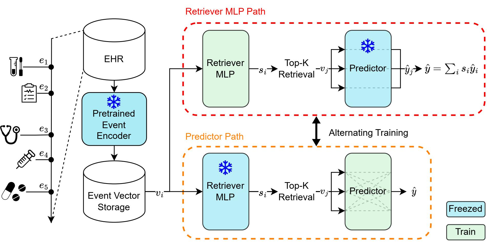

# REMed: Retrieval-Enhanced Medical Prediction Model
Official implementation for [General-purpose Retrieval-Enhanced Medical Prediction Model using Near-Infinite History](https://arxiv.org/abs/2310.20204v1)

> Developing medical prediction models based on EHRs typically relies on expert opinion for feature selection and adjusting the observation window size.
To address these issues, we propose **R**etrieval-**E**nhanced **Med**ical prediction model (**REMed**), which can essentially evaluate an unlimited number of medical events, retrieve the relevant ones, and make predictions.



## Standalone REMed
- For enhanced accessibility, we offer a simplified, standalone REMed model available in `standalone_remed.py`.
- This model takes a list of event vectors and their corresponding timestamps as input, and performs a binary classification.
- For multi-task or multi-class support, please refer to the original code.
- Dependencies: `pytorch` and `transformers`.

```python
import torch
from standalone_remed import REMed

model = REMed(
    pred_dim=512,  # Model hidden dimension size (E)
    n_heads=8,  # Number of heads for Transformer Predictor
    n_layers=2,  # Number of layers for Transformer Predictor
    dropout=0.2,  # Dropout rate
    max_retrieve_len=128,  # Maximum number of retrieved events (k of Top-k)
    pred_time=48,  # Prediction time. Set to maximum of the input timestamp (h)
)

reprs = torch.randn(2, 1000, 512) # Batch of list of event vectors (B, L, E)
times = torch.randint(0, 48*60, (2, 1000)) # Batch of list of event times (B, L) (unit=Minute)

model(reprs, times) # Return probability between [0,1] (B, 1)
```


## Reproducing  Guide

<details>
<summary>Requirements</summary>

- For preprocessing: `python>=3.8, Java>=8`
```bash
pip install numpy pandas tqdm treelib transformers pyspark
```

- For training & test
```bash
export PATH=/usr/local/cuda/bin:$PATH
conda install pytorch==1.13.1 torchvision==0.14.1 torchaudio==0.13.1 pytorch-cuda=11.7 -c pytorch -c nvidia
conda install numpy pandas einops h5pickle tqdm scikit-learn -y
pip install performer_pytorch recurrent_memory_transformer_pytorch==0.2.2 transformers==4.30.1 accelerate 
cd src/models/kernel/
python setup.py install
```

</details>

<details>
<summary> Data Preprocessing </summary>

- We use [Integrated-EHR-Pipeline](https://github.com/Jwoo5/integrated-ehr-pipeline)
- NOTE: This process requires high RAM. If you meet out-of-memory, please lower the `--num_threads`

```bash
git clone https://github.com/Jwoo5/integrated-ehr-pipeline
git checkout snub
```

```bash
# MIMIC-IV, 48h Prediction time
python main.py --ehr mimiciv --data {MIMIC-IV Path} --obs_size 48 --pred_size 48 --max_patient_token_len 2147483647 --max_event_size 2147483647 --use_more_tables --dest {DATA_PATH}/48h --num_threads 32 --readmission --diagnosis --min_event_size 0 --seed "2020, 2021, 2022, 2023, 2024" --use_ed

# MIMIC-IV, 24h Prediction time
python main.py --ehr mimiciv --data {MIMIC-IV Path} --obs_size 48 --pred_size 24 --max_patient_token_len 2147483647 --max_event_size 2147483647 --use_more_tables --dest {DATA_PATH}/24h --num_threads 32 --readmission --diagnosis --min_event_size 0 --seed "2020, 2021, 2022, 2023, 2024" --use_ed

# eICU, 48h Prediction time
python main.py --ehr eicu --data {eICU Path} --obs_size 48 --pred_size 48 --max_patient_token_len 2147483647 --max_event_size 2147483647 --use_more_tables --dest {DATA_PATH}/48h --num_threads 32 --readmission --diagnosis --min_event_size 0 --seed "2020, 2021, 2022, 2023, 2024"

# eICU, 24h Prediction time
python main.py --ehr eicu --data {eICU Path} --obs_size 48 --pred_size 24 --max_patient_token_len 2147483647 --max_event_size 2147483647 --use_more_tables --dest {DATA_PATH}/24h --num_threads 32 --readmission --diagnosis --min_event_size 0 --seed "2020, 2021, 2022, 2023, 2024"
```

</details>

<details>
<summary>Pretrain Encoder & Caching</summary>

- We used NVIDIA RTX A6000 (48GB) for pretraining & Encoding
- If you meet CUDA OOM, please adjust the numbers in `src/main.py:270-271`
- This requires large empty disk space (>200G)

```bash
accelerate launch --config_file config/single.json --num_processes 1 --gpu_ids {GPU_ID} main.py --src {SRC_DATA} --input {DATA_PATH} --save_dir {SAVE_PATH} --train_type short --time -99999 --pred_time {PRED_TIME} --wandb_project_name {PROJECT_NAME} --wandb_entity_name {ENTITY_NAME} --lr 5e-5 --random_sample --encode_events
```
- As a result, you can get `{SRC_DATA}_encoded.h5` at `{SAVE_PATH}/{EXPERIMENT_NAME}`.


</details>

<details>
<summary>Train REMed</summary>

- Note that the `{EXPERIMENT_NAME}` refers to the name of the pre-training experiment.
- If you want to run an experiment with infinite observation window, set time=-99999
- Otherwise, the time should be {PRED_TIME} - {OBS_SIZE} (e.g. pred time 48h, obs 12h -> time 36)
```bash
accelerate launch --config_file config/single.json --num_processes 1 --gpu_ids {GPU_ID} main.py --src {SRC_DATA} --input {DATA_PATH} --save_dir {SAVE_PATH} --train_type remed --time {TIME} --pred_time {PRED_TIME} --wandb_project_name {PROJECT_NAME} --wandb_entity_name {ENTITY_NAME} --lr 5e-5 --scorer --scorer_use_time --pretrained {EXPERIMENT_NAME}
```

</details>

## Citation
```
@misc{kim2023generalpurpose,
      title={General-Purpose Retrieval-Enhanced Medical Prediction Model Using Near-Infinite History}, 
      author={Junu Kim and Chaeeun Shim and Bosco Seong Kyu Yang and Chami Im and Sung Yoon Lim and Han-Gil Jeong and Edward Choi},
      year={2023},
      eprint={2310.20204},
      archivePrefix={arXiv},
      primaryClass={cs.LG}
}
```
